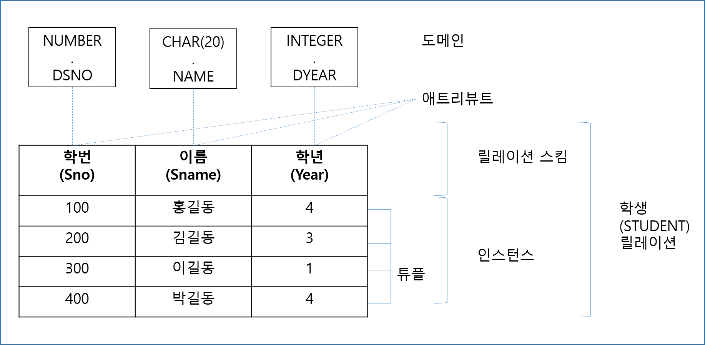

= Database 설계
include::../style/style.adoc[]

== 데이터베이스 설게 단계
요구조건 분석 > 개념설계(E-R 모델) > 논리설계(데이터모델링) > 물리설계(데이터구조화) > 구현

=== 요구조건 분석
=== 개념설계
=== 논리설계
=== 물리설계
=== 구현

image::../imgs/20160725095856321.png[]

|====
| 단계 |
|====

=== 함수종속
|===
| 규칙     | 조건                | 결과
| 재귀규칙  | Y &sub; X          | X -> Y
| 증가규칙  | X -> Y             | WX -> WY and WX -> Y
| 이행규칙  | X -> Y and Y -> Z  | X -> Z
| 결합규칙  | X -> Y and X -> Z  | X -> YZ
| 분해규칙  | X -> YZ            | X -> Y and X -> Z
| 가 이행규칙| W -> X and XY -> Z | WY -> Z
|===

== 정규화(Normalization)
=== 이상현상(Data Anomalies)
==== 갱신이상(Update Anomaly)
==== 삽입이상(Insert Anomaly)
==== 삭제이상(Delete Anomaly)

=== 1NF
=== 2NF
=== 3NF
=== BCNF
